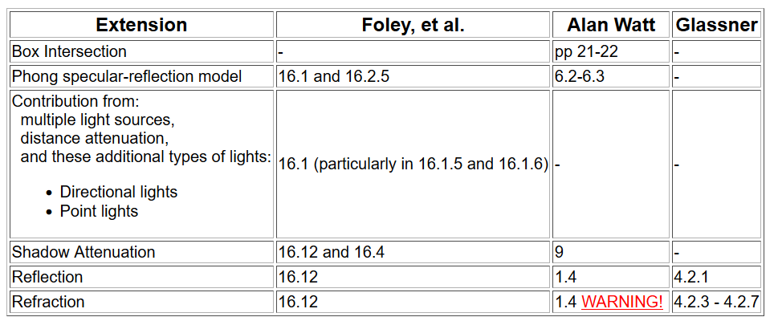

# Project 3 : Ray-Tracker
> **Assigned : Mar 23** \
> **Due : Apr 20**

## Basic Requirement

### List
1. Implement the box intersections and expand ray-casting into ray-tracing by adding support for reflected and refracted rays
   
2. Implement the Phong specular-reflection model and include support for transparent objects.

3. Ray tracer should recursively trace rays to account for these. Recursion should proceed to a maximum depth as set by the user.

4. Extend the following program:

### Progress
#### Task 1
- [X] box intersections
- [X] expand ray-casting into ray-tracing

#### Task 2 - Phong specular-reflection model
- [X] Implement Model
- [X] Support for transparent objects

#### Task 3 - Ray tracer
- [X] Recursively trace rays to account
- [X] Recursively proceed to a maximum depth as set by the user

#### Task 4 - Program extension
- [X] Box Intersection
- [X] Phong specular-reflection model
- [X] Directional Lights
- [X] Point Lights 
- [X] Shadow Attenuation
- [X] Reflection
- [ ] Refraction

## Bells and Whistles
> **Total marks: 11.5/46.5** \
> 1 Bell = 1 mark, 1 whistle = 0.5 mark\
> I am summarizing the key points into bullet points. Please always check the [real requirement](https://course.cse.ust.hk/comp4411/Password_Only/projects/trace02/index.html) before start working on it due to my poor english orz.

- [X] [0.5] Implement an adaptive termination criterion for tracing rays, based on ray contribution.  Control the adaptation  threshold with a slider.
- [X] [0.5/**1**] Implement antialiasing by supersampling and averaging down.  **(This whistle upgrades to a bell if you implement the first stage of distribution ray tracing by jittering the sub-pixel samples.)**

- [X] [1] Implement spot lights. 
- [X] [1] Add a menu option that lets you specify a background image. to replace the environment's ambient color during the rendering. 
- [ ] [1] Find a good way to accelerate shadow attenuation. (use hierical bonding volume to avoid intersection checking)
- [ ] [1] Deal with overlapping objects intelligently. (object inside object overlapping with depth test: refraction.ray)

- [ ] [1.5] Add texture mapping support to the program. (2D to 2D, u-v map)
- [ ] [1.5] Implement antialiasing by adaptive supersampling, as described in Foley, et al., 15.10.4.  For full credit, you must show some sort of visualization of the sampling pattern that results. (highlight the high frequency region, supersample the change of intensity of the model)
- [X] [1.5] Implement more versatile lighting controls, such as the Warn model described in Foley 16.1.5.
  
- [ ] [2] Implement bump mapping (Watt 8.4; Foley, et al. 16.3.3). (world and world_normal)
- [ ] [2] Implement solid textures or some other form of procedural texture mapping, as described in Foley, et al., 20.1.2 and 20.8.3. (design a math equation to generate 3D texture map + add randomness)
- [ ] [2] Add some new types of geometry to the ray tracer.
- [ ] [2] Add support for height-fields. (displacement mapping: construct a polygonal "mesh based model)
- [X] [6.5(2+1.5*3)] Implement distribution ray tracing to produce one or more or the following effects: depth of field, soft shadows, motion blur, or glossy reflection (See Watt 10.6, Glassner, chapter 5, or Foley, et al., 16.12.4). (see L11 lecture notes & depth of field: forcal length)
  - [X] depth of field
  - [X] soft shadows
  - [X] motion blur
  - [X] glossy reflection

- [ ] [3] Add some higher-level geometry to the ray tracer, such as surfaces of revolution, extrusions, metaballs or blend surfaces.
- [ ] [3] Implement ray-intersection optimization by either implement the BSP Tree implemented or by implementing a different optimization method, such as hierarchical bounding volumes (See Glassner 6.4 and 6.5, Foley, et al., 15.10.2).

- [ ] [4] Implement a more realistic shading model. Credit will vary depending on the sophistication of the model.
- [ ] [4] Implement CSG, constructive solid geometry. (if ray intersect B, return other (TA said is simple))
- [ ] [4] Add a particle systems simulation and renderer (Foley 20.5, Watt 17.7). 
- [ ] [4] Implement caustics.

